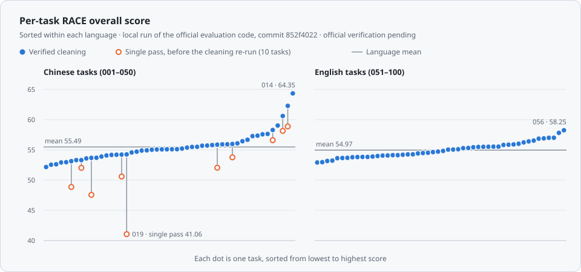

<!-- Generated from data/deep-cove-research.jsonl, results/race_scores.json and results/cleaning_evidence.json; do not edit by hand. -->

<p align="center">
  
</p>

<h1 align="center">deep-cove-research</h1>

<p align="center">
  A proprietary deep-research system.<br>
  This repository publishes its 100 DeepResearch Bench reports, written by GPT-5.6 Luna at its maximum reasoning setting, and their RACE evaluation.
</p>

<p align="center">
  <a href="https://github.com/Ayanami0730/deep_research_bench"></a>
  <a href="reports/README.md"></a>
  <a href="#results"></a>
  <a href="https://huggingface.co/spaces/muset-ai/DeepResearch-Bench-Leaderboard"></a>
  <a href="LICENSE"></a>
</p>

<p align="center">
  <a href="#results">Results</a> · <a href="#reports">Reports</a> · <a href="#how-it-works">How it works</a> · <a href="#data">Data</a> · <a href="#reproducing-the-evaluation">Reproduce</a> · <a href="#citation">Citation</a>
  &nbsp;|&nbsp; <b>English</b> · <a href="README_zh.md">中文</a>
</p>

> [!NOTE]
> **Status as of 2026-09-25:** the scores on this page come from a local run of the official DeepResearch Bench RACE evaluation code (commit `852f4022`) with its default evaluator settings. Official verification is pending; officially verified results are listed on the [official leaderboard](https://huggingface.co/spaces/muset-ai/DeepResearch-Bench-Leaderboard). This repository publishes the 100 reports and their evaluation results. The system's source code is not released.

## Results

DeepResearch Bench has 100 research tasks, 50 in Chinese and 50 in English. Its RACE metric scores each report against the benchmark's reference report on four dimensions (comprehensiveness, insight, instruction following and readability), with criteria and weights set for each task. Scores are on the leaderboard's 0–100 scale.

| Evaluation | Overall | Comprehensiveness | Insight | Instruction following | Readability |
|:--|--:|--:|--:|--:|--:|
| Verified cleaning ¹ | **55.23** | 55.80 | 55.92 | 55.23 | 52.26 |
| Single pass ² | 54.81 | 55.25 | 55.48 | 54.85 | 52.10 |

1. **Verified cleaning:** the official pipeline, with the cleaning step run once more for the 10 reports whose single-pass cleaning output was cut short, and those outputs scored as returned (see [Cleaning step](#cleaning-step)); the other 90 reports have the same score in both rows. "Verified" names this re-check (key `verified_cleaning` in [`results/race_scores.json`](results/race_scores.json)); it is not the official verification, which is pending.
2. **Single pass:** the official pipeline run once, end to end, accepting every cleaning output.

Both rows: all 100 tasks scored; local run of the official evaluation code, commit `852f4022`, default evaluator settings (the benchmark's official RACE evaluator is GPT-5.5).

### By language

| Tasks | Mean score, verified cleaning | Mean score, single pass | Lowest – highest, verified cleaning |
|:--|--:|--:|--:|
| Chinese (001–050) | 55.49 | 54.65 | 52.17 – 64.35 |
| English (051–100) | 54.97 | 54.97 | 52.92 – 58.25 |
| All 100 | **55.23** | 54.81 | 52.17 – 64.35 |

Means of the per-task overall scores in [`results/race_scores.json`](results/race_scores.json); the mean over all 100 tasks equals the overall score above. Per task, that file holds only the overall score, so the four dimensions cannot be split by language.

<p align="center">
  <picture>
    <source media="(prefers-color-scheme: dark)" srcset="assets/scores-en-dark.svg">
    
  </picture>
</p>

<sub>**Figure 1.** Per-task RACE overall scores, sorted within each language. Filled dots: verified cleaning. Open dots: single-pass scores of the 10 Chinese tasks whose cleaning step was re-run. Horizontal lines: language means. Every value is listed in the [report index](reports/README.md).</sub>

## Reports

Every report has its own page: the report's scores, the benchmark prompt, then the report text exactly as submitted.

**[Browse all 100 reports →](reports/README.md)**

<details>
<summary>Jump to a report by task number</summary>

<table>
  <tr><th rowspan="5">Chinese</th><td align="center"><a href="reports/zh/001.md">001</a></td><td align="center"><a href="reports/zh/002.md">002</a></td><td align="center"><a href="reports/zh/003.md">003</a></td><td align="center"><a href="reports/zh/004.md">004</a></td><td align="center"><a href="reports/zh/005.md">005</a></td><td align="center"><a href="reports/zh/006.md">006</a></td><td align="center"><a href="reports/zh/007.md">007</a></td><td align="center"><a href="reports/zh/008.md">008</a></td><td align="center"><a href="reports/zh/009.md">009</a></td><td align="center"><a href="reports/zh/010.md">010</a></td></tr>
  <tr><td align="center"><a href="reports/zh/011.md">011</a></td><td align="center"><a href="reports/zh/012.md">012</a></td><td align="center"><a href="reports/zh/013.md">013</a></td><td align="center"><a href="reports/zh/014.md">014</a></td><td align="center"><a href="reports/zh/015.md">015</a></td><td align="center"><a href="reports/zh/016.md">016</a></td><td align="center"><a href="reports/zh/017.md">017</a></td><td align="center"><a href="reports/zh/018.md">018</a></td><td align="center"><a href="reports/zh/019.md">019</a></td><td align="center"><a href="reports/zh/020.md">020</a></td></tr>
  <tr><td align="center"><a href="reports/zh/021.md">021</a></td><td align="center"><a href="reports/zh/022.md">022</a></td><td align="center"><a href="reports/zh/023.md">023</a></td><td align="center"><a href="reports/zh/024.md">024</a></td><td align="center"><a href="reports/zh/025.md">025</a></td><td align="center"><a href="reports/zh/026.md">026</a></td><td align="center"><a href="reports/zh/027.md">027</a></td><td align="center"><a href="reports/zh/028.md">028</a></td><td align="center"><a href="reports/zh/029.md">029</a></td><td align="center"><a href="reports/zh/030.md">030</a></td></tr>
  <tr><td align="center"><a href="reports/zh/031.md">031</a></td><td align="center"><a href="reports/zh/032.md">032</a></td><td align="center"><a href="reports/zh/033.md">033</a></td><td align="center"><a href="reports/zh/034.md">034</a></td><td align="center"><a href="reports/zh/035.md">035</a></td><td align="center"><a href="reports/zh/036.md">036</a></td><td align="center"><a href="reports/zh/037.md">037</a></td><td align="center"><a href="reports/zh/038.md">038</a></td><td align="center"><a href="reports/zh/039.md">039</a></td><td align="center"><a href="reports/zh/040.md">040</a></td></tr>
  <tr><td align="center"><a href="reports/zh/041.md">041</a></td><td align="center"><a href="reports/zh/042.md">042</a></td><td align="center"><a href="reports/zh/043.md">043</a></td><td align="center"><a href="reports/zh/044.md">044</a></td><td align="center"><a href="reports/zh/045.md">045</a></td><td align="center"><a href="reports/zh/046.md">046</a></td><td align="center"><a href="reports/zh/047.md">047</a></td><td align="center"><a href="reports/zh/048.md">048</a></td><td align="center"><a href="reports/zh/049.md">049</a></td><td align="center"><a href="reports/zh/050.md">050</a></td></tr>
  <tr><th rowspan="5">English</th><td align="center"><a href="reports/en/051.md">051</a></td><td align="center"><a href="reports/en/052.md">052</a></td><td align="center"><a href="reports/en/053.md">053</a></td><td align="center"><a href="reports/en/054.md">054</a></td><td align="center"><a href="reports/en/055.md">055</a></td><td align="center"><a href="reports/en/056.md">056</a></td><td align="center"><a href="reports/en/057.md">057</a></td><td align="center"><a href="reports/en/058.md">058</a></td><td align="center"><a href="reports/en/059.md">059</a></td><td align="center"><a href="reports/en/060.md">060</a></td></tr>
  <tr><td align="center"><a href="reports/en/061.md">061</a></td><td align="center"><a href="reports/en/062.md">062</a></td><td align="center"><a href="reports/en/063.md">063</a></td><td align="center"><a href="reports/en/064.md">064</a></td><td align="center"><a href="reports/en/065.md">065</a></td><td align="center"><a href="reports/en/066.md">066</a></td><td align="center"><a href="reports/en/067.md">067</a></td><td align="center"><a href="reports/en/068.md">068</a></td><td align="center"><a href="reports/en/069.md">069</a></td><td align="center"><a href="reports/en/070.md">070</a></td></tr>
  <tr><td align="center"><a href="reports/en/071.md">071</a></td><td align="center"><a href="reports/en/072.md">072</a></td><td align="center"><a href="reports/en/073.md">073</a></td><td align="center"><a href="reports/en/074.md">074</a></td><td align="center"><a href="reports/en/075.md">075</a></td><td align="center"><a href="reports/en/076.md">076</a></td><td align="center"><a href="reports/en/077.md">077</a></td><td align="center"><a href="reports/en/078.md">078</a></td><td align="center"><a href="reports/en/079.md">079</a></td><td align="center"><a href="reports/en/080.md">080</a></td></tr>
  <tr><td align="center"><a href="reports/en/081.md">081</a></td><td align="center"><a href="reports/en/082.md">082</a></td><td align="center"><a href="reports/en/083.md">083</a></td><td align="center"><a href="reports/en/084.md">084</a></td><td align="center"><a href="reports/en/085.md">085</a></td><td align="center"><a href="reports/en/086.md">086</a></td><td align="center"><a href="reports/en/087.md">087</a></td><td align="center"><a href="reports/en/088.md">088</a></td><td align="center"><a href="reports/en/089.md">089</a></td><td align="center"><a href="reports/en/090.md">090</a></td></tr>
  <tr><td align="center"><a href="reports/en/091.md">091</a></td><td align="center"><a href="reports/en/092.md">092</a></td><td align="center"><a href="reports/en/093.md">093</a></td><td align="center"><a href="reports/en/094.md">094</a></td><td align="center"><a href="reports/en/095.md">095</a></td><td align="center"><a href="reports/en/096.md">096</a></td><td align="center"><a href="reports/en/097.md">097</a></td><td align="center"><a href="reports/en/098.md">098</a></td><td align="center"><a href="reports/en/099.md">099</a></td><td align="center"><a href="reports/en/100.md">100</a></td></tr>
</table>

</details>

**Excerpt** from the report for the first English task, [051](reports/en/051.md):

> The market implication is not a single, reliably measurable “elderly market” total. Food is the largest recurring expenditure, while spending per household generally declines with age and is especially constrained among single-person and pension-dependent households. The most defensible growth opportunities are narrower than the total market: health-oriented and care food, adaptive clothing, barrier-free renovation and supported housing, and accessible or demand-responsive mobility. A complete, harmonized 65+ market total for clothing, food, housing, and transportation in 2030 or 2050 is not reported in the supplied evidence; this report therefore combines observed expenditure benchmarks, conditional calculations, and clearly bounded submarket proxies without adding incompatible forecasts.

## How it works

<p align="center">
  <picture>
    <source media="(prefers-color-scheme: dark)" srcset="assets/pipeline-en-dark.svg">
    
  </picture>
</p>

<sub>**Figure 2.** The six stages deep-cove-research runs for each question.</sub>

For each question, deep-cove-research:

1. plans the research: what must be answered and how the report should be structured;
2. searches the open web and the scholarly literature;
3. reads the full text of the selected sources;
4. extracts cited findings from them;
5. checks coverage against the question's requirements;
6. writes a long-form report.

The reports are written by **GPT-5.6 Luna** at its maximum reasoning setting.

## Report statistics

| | Chinese (001–050) | English (051–100) | All 100 |
|:--|--:|--:|--:|
| Median length, characters | 29,832.5 | 91,564 | 50,479 |
| Shortest – longest, characters | 12,558 – 48,775 | 52,183 – 124,994 | 12,558 – 124,994 |
| Median length, words | – | 12,238 | – |
| Median source links per report | 58 | 61 | 58.5 |
| Median distinct sources per report | 38.5 | 43 | 41 |
| Distinct source addresses, all reports | 1,935 | 2,078 | 4,007 |
| Median sections (level-2 headings) | 8 | 9 | 8.5 |
| Reports with at least one table | 50 of 50 | 50 of 50 | 100 of 100 |

Characters are Unicode characters (the `raw_chars` field of `results/cleaning_evidence.json`); words are whitespace-separated tokens, counted for English reports only. Source links are the web addresses a report links to or embeds, counted each time they appear; distinct sources counts different addresses within one report. Distinct source addresses are counted once per column; 6 addresses appear in both a Chinese and an English report, so the All column is smaller than the sum of the two language columns.

## Cleaning step

Before scoring, the official pipeline asks a model to remove citations from each report; the evaluator then scores the cleaned text. [`results/cleaning_evidence.json`](results/cleaning_evidence.json) records each report's length before and after this step.

In the single pass, the cleaned text of 10 of the 50 Chinese reports was cut short, keeping between 11.3% and 66.4% of the report's characters, and the pipeline accepted those outputs. For the other 90 reports the step kept between 70.2% and 97.9% (median 89.1%). The step was run again for the 10 affected reports; the verified-cleaning row uses those runs and leaves the other 90 scores unchanged.

| Task | Report length, characters | Kept, single pass | Kept, re-run | Score, single pass | Score, verified cleaning |
|--:|--:|--:|--:|--:|--:|
| [005](reports/zh/005.md) | 30,150 | 33.1% | 84.0% | 52.05 | 55.87 |
| [008](reports/zh/008.md) | 32,298 | 18.9% | 33.5% | 48.86 | 53.14 |
| [011](reports/zh/011.md) | 30,518 | 66.4% | 85.0% | 56.60 | 58.29 |
| [016](reports/zh/016.md) | 35,078 | 18.7% | 89.1% | 58.88 | 62.29 |
| [017](reports/zh/017.md) | 28,195 | 12.4% | 82.2% | 47.56 | 53.68 |
| [019](reports/zh/019.md) | 46,765 | 11.3% | 82.4% | 41.06 | 54.26 |
| [020](reports/zh/020.md) | 48,775 | 60.8% | 89.8% | 58.15 | 60.61 |
| [035](reports/zh/035.md) | 31,670 | 32.8% | 84.9% | 53.77 | 55.98 |
| [047](reports/zh/047.md) | 31,869 | 29.4% | 62.8% | 50.60 | 54.22 |
| [050](reports/zh/050.md) | 26,406 | 54.9% | 72.3% | 52.03 | 53.31 |

The re-runs of tasks 008 (33.5%) and 047 (62.8%) still kept less than any of the other 90 reports; the verified-cleaning row scores them as returned. Across all 100 tasks, the overall score moves from 54.81 (single pass) to 55.23 (verified cleaning).

## Data

```text
deep-cove-research/
├── README.md                      overview (English)
├── README_zh.md                   overview (Chinese)
├── data/
│   ├── README.md                  field descriptions
│   └── deep-cove-research.jsonl   the 100 reports as submitted, official format
├── results/
│   ├── README.md                  field descriptions
│   ├── race_scores.json           overall and per-task RACE scores, both evaluations
│   └── cleaning_evidence.json     per-task length before and after the cleaning step
├── reports/
│   ├── README.md                  index of all 100 reports
│   ├── zh/001.md … 050.md         Chinese reports, one page each
│   └── en/051.md … 100.md         English reports, one page each
├── assets/                        logo, badges and figures (SVG)
├── CITATION.cff                   citation metadata
└── LICENSE                        terms (proprietary)
```

- [`data/deep-cove-research.jsonl`](data/deep-cove-research.jsonl): 100 lines, one JSON object per line (UTF-8), in the official DeepResearch Bench format with the fields `id`, `prompt` and `article`. Tasks 1–50 are Chinese, 51–100 English. 8,010,129 bytes; SHA-256 `2578948bbb4555c30c3dc9c1bc245a59e2c1575f0c2a8fd5c3f7c3ccad3c12e3`. Field details: [data/README.md](data/README.md).
- Each page in [`reports/`](reports/README.md) contains its report's `article` text byte for byte and states the SHA-256 of that text.
- [`results/`](results/README.md): the RACE scores and the cleaning evidence; field details in [results/README.md](results/README.md).
- Not included: the system's source code, its internal prompts and its intermediate data. This repository reports RACE only; the benchmark's FACT citation metrics are not included.

## Reproducing the evaluation

1. Get the official evaluation code from the [DeepResearch Bench repository](https://github.com/Ayanami0730/deep_research_bench) at commit `852f4022`.
2. Copy `data/deep-cove-research.jsonl` into that copy of the code as `data/test_data/raw_data/deep-cove-research.jsonl`.
3. Add `deep-cove-research` to `TARGET_MODELS` in `run_benchmark.sh`.
4. Set up access to the evaluator as the benchmark's README describes, keeping the default evaluator settings.
5. Run `run_benchmark.sh`; only its RACE phase is reported here. The RACE summary is written to `results/race/deep-cove-research/race_result.txt` on a 0–1 scale (this page multiplies by 100), and the cleaned reports to `data/test_data/cleaned_data/deep-cove-research.jsonl`, which can be compared with `results/cleaning_evidence.json`.

The cleaning step and the evaluator are both language models, so a new run can give different scores. The cleaning re-run described above is one example: it moved task 019 from 41.06 to 54.26, and the overall score from 54.81 to 55.23.

## Citation

If you refer to these reports or results, please cite this repository and the DeepResearch Bench paper.

**This repository**

```bibtex
@misc{deepcoveresearch2026,
  title = {deep-cove-research: DeepResearch Bench Reports and Evaluation Results},
  author = {{deep-cove-research}},
  year = {2026},
  howpublished = {\url{https://github.com/aldrinor/deep-cove-research}},
  note = {100 reports (50 Chinese, 50 English); RACE scores from a local run
          of the official evaluation code, commit 852f4022; official verification pending},
}
```

**DeepResearch Bench**

```bibtex
@inproceedings{ICLR2026_465f22be,
  author = {Du, Mingxuan and Xu, Benfeng and Zhu, Chiwei and Zhang, Licheng and Wang, Xiaorui and Mao, Zhendong},
  booktitle = {International Conference on Learning Representations},
  editor = {C. Vondrick and B. Hariharan and C. Raffel and L. Pinto and D. Yang and A. Faust},
  pages = {42414--42448},
  title = {DeepResearch Bench: A Comprehensive Benchmark for Deep Research Agents},
  url = {https://proceedings.iclr.cc/paper_files/paper/2026/file/465f22be10e07b301c6ed58f0472f704-Paper-Conference.pdf},
  volume = {2026},
  year = {2026},
}
```

## License

Proprietary. The reports and evaluation results in this repository are © 2026 deep-cove-research, all rights reserved; see [LICENSE](LICENSE). The benchmark prompts, shown on the report pages and in the `prompt` field, are part of DeepResearch Bench and belong to its authors. The system's source code is not released.

## Contact

aor@cpolartechnologies.com

## Acknowledgements

We thank the DeepResearch Bench team (Mingxuan Du, Benfeng Xu, Chiwei Zhu, Licheng Zhang, Xiaorui Wang and Zhendong Mao) for the benchmark, its official evaluation code and the leaderboard.
