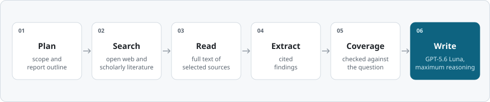

<!-- Generated from data/deep-cove-research.jsonl; do not edit by hand. -->

<h1 align="center">deep-cove-research</h1>

<p align="center">
  A proprietary deep-research system.<br>
  100 DeepResearch Bench reports, written by GPT-5.6 Luna at its maximum reasoning setting.<br>
  Made in North Vancouver, Canada.
</p>

<p align="center">
  <a href="https://github.com/Ayanami0730/deep_research_bench"></a>
  <a href="reports/README.md"></a>
  <a href="#at-a-glance"></a>
  <a href="LICENSE"></a>
</p>

<p align="center">
  <a href="#at-a-glance">At a glance</a> · <a href="#reports">Reports</a> · <a href="#how-it-works">How it works</a> · <a href="#data">Data</a> · <a href="#reproducing-the-evaluation">Reproduce</a> · <a href="#citation">Citation</a>
</p>

## At a glance

<div align="center">

| Reports | Languages | Writer | Average cost per report |
|:-:|:-:|:-:|:-:|
| **100** | 50 Chinese · 50 English | GPT-5.6 Luna, maximum reasoning | **≈ US$0.45** |

<sub>Average model and search usage per report, priced at public API list prices.</sub>

</div>

## Reports

Every report has its own page: the benchmark prompt, then the report text exactly as submitted.

**[Browse all 100 reports →](reports/README.md)**

<details>
<summary>Jump to a report by task number</summary>

<table>
  <tr><th rowspan="5">Chinese</th><td align="center"><a href="reports/zh/001.md">001</a></td><td align="center"><a href="reports/zh/002.md">002</a></td><td align="center"><a href="reports/zh/003.md">003</a></td><td align="center"><a href="reports/zh/004.md">004</a></td><td align="center"><a href="reports/zh/005.md">005</a></td><td align="center"><a href="reports/zh/006.md">006</a></td><td align="center"><a href="reports/zh/007.md">007</a></td><td align="center"><a href="reports/zh/008.md">008</a></td><td align="center"><a href="reports/zh/009.md">009</a></td><td align="center"><a href="reports/zh/010.md">010</a></td></tr>
  <tr><td align="center"><a href="reports/zh/011.md">011</a></td><td align="center"><a href="reports/zh/012.md">012</a></td><td align="center"><a href="reports/zh/013.md">013</a></td><td align="center"><a href="reports/zh/014.md">014</a></td><td align="center"><a href="reports/zh/015.md">015</a></td><td align="center"><a href="reports/zh/016.md">016</a></td><td align="center"><a href="reports/zh/017.md">017</a></td><td align="center"><a href="reports/zh/018.md">018</a></td><td align="center"><a href="reports/zh/019.md">019</a></td><td align="center"><a href="reports/zh/020.md">020</a></td></tr>
  <tr><td align="center"><a href="reports/zh/021.md">021</a></td><td align="center"><a href="reports/zh/022.md">022</a></td><td align="center"><a href="reports/zh/023.md">023</a></td><td align="center"><a href="reports/zh/024.md">024</a></td><td align="center"><a href="reports/zh/025.md">025</a></td><td align="center"><a href="reports/zh/026.md">026</a></td><td align="center"><a href="reports/zh/027.md">027</a></td><td align="center"><a href="reports/zh/028.md">028</a></td><td align="center"><a href="reports/zh/029.md">029</a></td><td align="center"><a href="reports/zh/030.md">030</a></td></tr>
  <tr><td align="center"><a href="reports/zh/031.md">031</a></td><td align="center"><a href="reports/zh/032.md">032</a></td><td align="center"><a href="reports/zh/033.md">033</a></td><td align="center"><a href="reports/zh/034.md">034</a></td><td align="center"><a href="reports/zh/035.md">035</a></td><td align="center"><a href="reports/zh/036.md">036</a></td><td align="center"><a href="reports/zh/037.md">037</a></td><td align="center"><a href="reports/zh/038.md">038</a></td><td align="center"><a href="reports/zh/039.md">039</a></td><td align="center"><a href="reports/zh/040.md">040</a></td></tr>
  <tr><td align="center"><a href="reports/zh/041.md">041</a></td><td align="center"><a href="reports/zh/042.md">042</a></td><td align="center"><a href="reports/zh/043.md">043</a></td><td align="center"><a href="reports/zh/044.md">044</a></td><td align="center"><a href="reports/zh/045.md">045</a></td><td align="center"><a href="reports/zh/046.md">046</a></td><td align="center"><a href="reports/zh/047.md">047</a></td><td align="center"><a href="reports/zh/048.md">048</a></td><td align="center"><a href="reports/zh/049.md">049</a></td><td align="center"><a href="reports/zh/050.md">050</a></td></tr>
  <tr><th rowspan="5">English</th><td align="center"><a href="reports/en/051.md">051</a></td><td align="center"><a href="reports/en/052.md">052</a></td><td align="center"><a href="reports/en/053.md">053</a></td><td align="center"><a href="reports/en/054.md">054</a></td><td align="center"><a href="reports/en/055.md">055</a></td><td align="center"><a href="reports/en/056.md">056</a></td><td align="center"><a href="reports/en/057.md">057</a></td><td align="center"><a href="reports/en/058.md">058</a></td><td align="center"><a href="reports/en/059.md">059</a></td><td align="center"><a href="reports/en/060.md">060</a></td></tr>
  <tr><td align="center"><a href="reports/en/061.md">061</a></td><td align="center"><a href="reports/en/062.md">062</a></td><td align="center"><a href="reports/en/063.md">063</a></td><td align="center"><a href="reports/en/064.md">064</a></td><td align="center"><a href="reports/en/065.md">065</a></td><td align="center"><a href="reports/en/066.md">066</a></td><td align="center"><a href="reports/en/067.md">067</a></td><td align="center"><a href="reports/en/068.md">068</a></td><td align="center"><a href="reports/en/069.md">069</a></td><td align="center"><a href="reports/en/070.md">070</a></td></tr>
  <tr><td align="center"><a href="reports/en/071.md">071</a></td><td align="center"><a href="reports/en/072.md">072</a></td><td align="center"><a href="reports/en/073.md">073</a></td><td align="center"><a href="reports/en/074.md">074</a></td><td align="center"><a href="reports/en/075.md">075</a></td><td align="center"><a href="reports/en/076.md">076</a></td><td align="center"><a href="reports/en/077.md">077</a></td><td align="center"><a href="reports/en/078.md">078</a></td><td align="center"><a href="reports/en/079.md">079</a></td><td align="center"><a href="reports/en/080.md">080</a></td></tr>
  <tr><td align="center"><a href="reports/en/081.md">081</a></td><td align="center"><a href="reports/en/082.md">082</a></td><td align="center"><a href="reports/en/083.md">083</a></td><td align="center"><a href="reports/en/084.md">084</a></td><td align="center"><a href="reports/en/085.md">085</a></td><td align="center"><a href="reports/en/086.md">086</a></td><td align="center"><a href="reports/en/087.md">087</a></td><td align="center"><a href="reports/en/088.md">088</a></td><td align="center"><a href="reports/en/089.md">089</a></td><td align="center"><a href="reports/en/090.md">090</a></td></tr>
  <tr><td align="center"><a href="reports/en/091.md">091</a></td><td align="center"><a href="reports/en/092.md">092</a></td><td align="center"><a href="reports/en/093.md">093</a></td><td align="center"><a href="reports/en/094.md">094</a></td><td align="center"><a href="reports/en/095.md">095</a></td><td align="center"><a href="reports/en/096.md">096</a></td><td align="center"><a href="reports/en/097.md">097</a></td><td align="center"><a href="reports/en/098.md">098</a></td><td align="center"><a href="reports/en/099.md">099</a></td><td align="center"><a href="reports/en/100.md">100</a></td></tr>
</table>

</details>

## How it works

<p align="center">
  <picture>
    <source media="(prefers-color-scheme: dark)" srcset="assets/pipeline-en-dark.svg">
    
  </picture>
</p>

<sub>**Figure 1.** The six stages deep-cove-research runs for each question.</sub>

For each question, deep-cove-research:

1. plans the research: what must be answered and how the report should be structured;
2. searches the open web and the scholarly literature;
3. reads the full text of the selected sources;
4. extracts cited findings from them;
5. checks coverage against the question's requirements;
6. writes a long-form report.

The reports are written by **GPT-5.6 Luna** at its maximum reasoning setting.

## Report statistics

| | Chinese (001–050) | English (051–100) | All 100 |
|:--|--:|--:|--:|
| Median length, characters | 29,832.5 | 91,564 | 50,479 |
| Shortest – longest, characters | 12,558 – 48,775 | 52,183 – 124,994 | 12,558 – 124,994 |
| Median length, words | – | 12,238 | – |
| Median source links per report | 58 | 61 | 58.5 |
| Median distinct sources per report | 38.5 | 43 | 41 |
| Distinct source addresses, all reports | 1,935 | 2,078 | 4,007 |
| Median sections (level-2 headings) | 8 | 9 | 8.5 |
| Reports with at least one table | 50 of 50 | 50 of 50 | 100 of 100 |

<sub>Characters: Unicode characters in the report text. Words: whitespace-separated tokens, English reports only. Source links: web addresses a report links to, counted each time they appear. Distinct sources: different addresses within one report.</sub>

## Data

```text
deep-cove-research/
├── README.md                      overview
├── data/
│   ├── README.md                  field descriptions
│   └── deep-cove-research.jsonl   the 100 reports as submitted, official format
├── reports/
│   ├── README.md                  index of all 100 reports
│   ├── zh/001.md … 050.md         Chinese reports, one page each
│   └── en/051.md … 100.md         English reports, one page each
├── assets/                        badges and figures (SVG)
├── CITATION.cff                   citation metadata
└── LICENSE                        terms (proprietary)
```

- [`data/deep-cove-research.jsonl`](data/deep-cove-research.jsonl): 100 lines, one JSON object per line (UTF-8), in the official DeepResearch Bench format with the fields `id`, `prompt` and `article`. Tasks 1–50 are Chinese, 51–100 English. 8,010,129 bytes; SHA-256 `2578948bbb4555c30c3dc9c1bc245a59e2c1575f0c2a8fd5c3f7c3ccad3c12e3`. Field details: [data/README.md](data/README.md).
- Each page in [`reports/`](reports/README.md) contains its report's `article` text byte for byte and states the SHA-256 of that text.

## Reproducing the evaluation

1. Get the official evaluation code from the [DeepResearch Bench repository](https://github.com/Ayanami0730/deep_research_bench) at commit `852f4022`.
2. Copy `data/deep-cove-research.jsonl` into that copy of the code as `data/test_data/raw_data/deep-cove-research.jsonl`.
3. Add `deep-cove-research` to `TARGET_MODELS` in `run_benchmark.sh`.
4. Set up access to the evaluator as the benchmark's README describes, keeping the default evaluator settings.
5. Run `run_benchmark.sh`. The RACE summary is written to `results/race/deep-cove-research/race_result.txt`.

## Citation

If you refer to these reports, please cite this repository and the DeepResearch Bench paper.

**This repository**

```bibtex
@misc{deepcoveresearch2026,
  title = {deep-cove-research: DeepResearch Bench Reports},
  author = {{deep-cove-research}},
  year = {2026},
  howpublished = {\url{https://github.com/aldrinor/deep-cove-research}},
  note = {100 reports (50 Chinese, 50 English)},
}
```

**DeepResearch Bench**

```bibtex
@inproceedings{ICLR2026_465f22be,
  author = {Du, Mingxuan and Xu, Benfeng and Zhu, Chiwei and Zhang, Licheng and Wang, Xiaorui and Mao, Zhendong},
  booktitle = {International Conference on Learning Representations},
  editor = {C. Vondrick and B. Hariharan and C. Raffel and L. Pinto and D. Yang and A. Faust},
  pages = {42414--42448},
  title = {DeepResearch Bench: A Comprehensive Benchmark for Deep Research Agents},
  url = {https://proceedings.iclr.cc/paper_files/paper/2026/file/465f22be10e07b301c6ed58f0472f704-Paper-Conference.pdf},
  volume = {2026},
  year = {2026},
}
```

## License

Proprietary. The reports in this repository are © 2026 deep-cove-research, all rights reserved; see [LICENSE](LICENSE). The benchmark prompts, shown on the report pages and in the `prompt` field, are part of DeepResearch Bench and belong to its authors.

## Contact

aor@cpolartechnologies.com

## Acknowledgements

We thank the DeepResearch Bench team (Mingxuan Du, Benfeng Xu, Chiwei Zhu, Licheng Zhang, Xiaorui Wang and Zhendong Mao) for the benchmark, its official evaluation code and the leaderboard.
