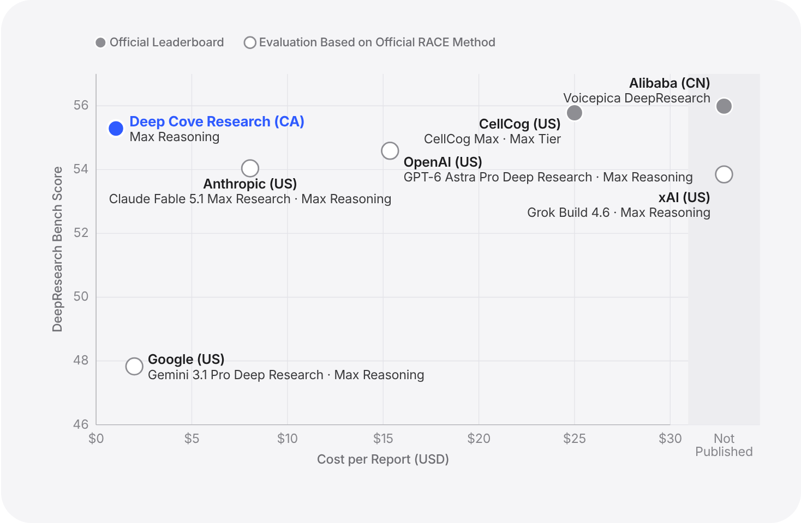
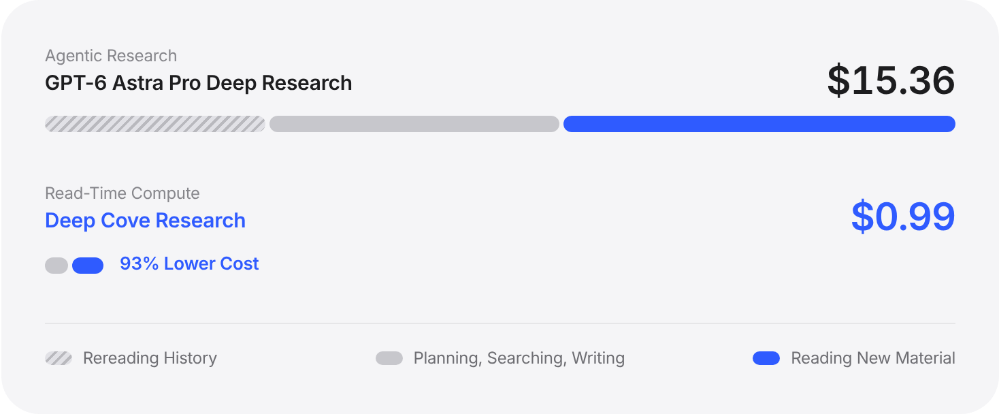
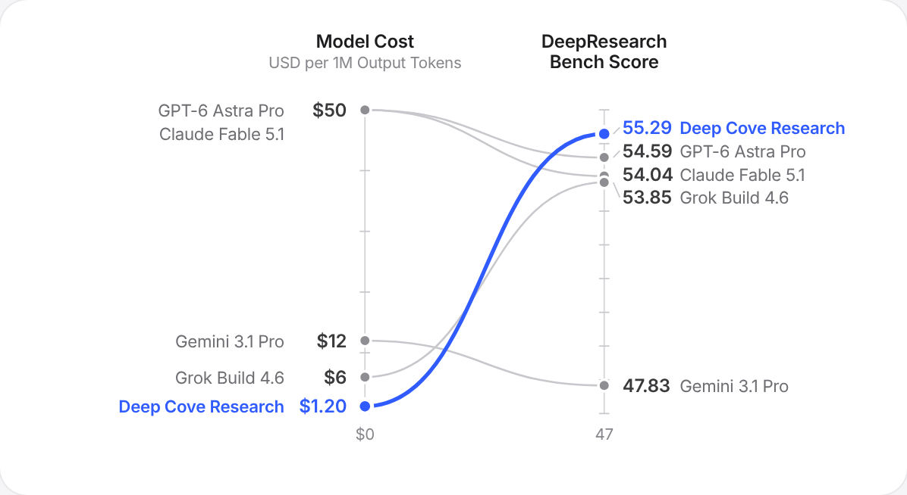
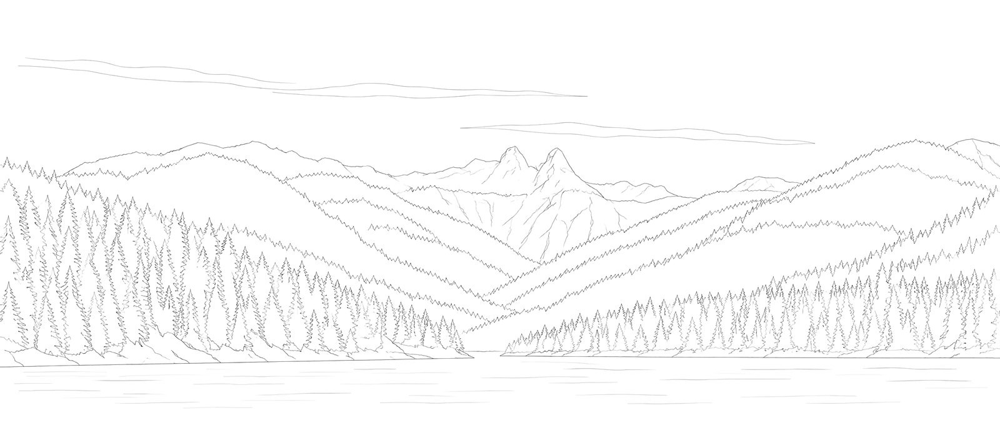

<p align="center">
  
</p>

<h1 align="center">Deep Cove Research</h1>

<p align="center">
  <b>A comprehension engine built on Read-Time Compute.</b><br>
  #3 on DeepResearch Bench<sup><a href="#sources">1</a></sup> · Up to 93% lower cost than frontier deep research agents<sup><a href="#sources">2</a></sup>
</p>

<p align="center">
  <a href="https://huggingface.co/spaces/muset-ai/DeepResearch-Bench-Leaderboard"></a>
  <a href="https://github.com/Ayanami0730/deep_research_bench"></a>
  <a href="reports/README.md"></a>
  <a href="#deepresearch-bench"></a>
  <a href="LICENSE"></a>
</p>

<p align="center">
  <a href="#deepresearch-bench">Benchmark</a> · <a href="#agents-spend-compute-looping-we-spend-it-on-comprehension">How It Works</a> · <a href="#inside-the-comprehension-engine">Engine</a> · <a href="#reports">Reports</a> · <a href="#data">Data</a> · <a href="#reproducing-the-evaluation">Reproduce</a> · <a href="#team">Team</a> · <a href="#contact">Contact</a>
</p>

Deep Cove Research comprehends full sources, then turns them into research reports at the level of frontier models,<sup>[3](#sources)</sup> for much less cost.<sup>[2](#sources)</sup>

## DeepResearch Bench

**#3 of 15** · **55.29** on the [official leaderboard](https://huggingface.co/spaces/muset-ai/DeepResearch-Bench-Leaderboard)<sup>[1](#sources)</sup>

A benchmark for deep research agents. It has 100 PhD-level research tasks, written by experts in 22 fields, in Chinese and English (ICLR 2026).<sup>[4](#sources)</sup>

45 organizations evaluate performance based on it, including NVIDIA, Google, Microsoft, Amazon, Salesforce, Alibaba, Baidu, Tencent, ByteDance and Huawei.<sup>[5](#sources)</sup>

<p align="center">
  <picture>
    <source media="(prefers-color-scheme: dark)" srcset="assets/chart-score-cost-dark.png">
    
  </picture>
</p>

<p align="right"><sub>Score and cost sources: <a href="#sources">3</a>, <a href="#sources">6</a></sub></p>

## Agents spend compute looping. We spend it on comprehension.

| Agentic Research | Read-Time Compute |
|:--|:--|
| **85%** of input tokens are rereading session history | **2%** of input tokens are rereading session history |
| Frontier research agents work in a loop: search, open a page, take notes, repeat. Before each new step, they read all their old notes again. So most of their effort goes into rereading, not into new sources.<sup>[2](#sources)</sup> | Our state-of-the-art orchestrator handles the loop itself, so the model does not reread old notes. We spend the savings on research: 5X more searches,<sup>[2](#sources)</sup> and an engine built to read thousands of sources.<sup>[7](#sources)</sup> |
| <sub>GPT-6 Astra Pro · Max Reasoning</sub> | <sub>Deep Cove Research · Max Reasoning</sub> |

## Looping has a price.

On average, frontier research agents cost $15.36 per task. Rereading their old notes is billed at a discount, but still costs $3.76, almost 4X our entire cost. Meanwhile, most of our cost goes to comprehending new sources.<sup>[2](#sources)</sup>

<p align="center">
  <picture>
    <source media="(prefers-color-scheme: dark)" srcset="assets/chart-cost-per-task-dark.png">
    
  </picture>
</p>

## Agents search the tips. We comprehend the whole source.

| Agentic Research | Read-Time Compute |
|:--|:--|
| **14** average searches per report | **68** average searches per report |
| Frontier research agents have limited memory, and the loop uses most of it. So they only have room for about 14 searches per report. For many sources, they read only the short snippet, not the complete content, so details are easy to miss or misread.<sup>[2](#sources)</sup> | Our state-of-the-art context management keeps the model's memory clear. So it has room for about 68 searches per report, 5X more than frontier agents. We comprehend the whole page and turn it into evidence cards for deep comprehension.<sup>[2](#sources)</sup> |
| <sub>GPT-6 Astra Pro · Max Reasoning</sub> | <sub>Deep Cove Research · Max Reasoning</sub> |

## Inside the comprehension engine.

### A lighter model. A higher score.

The comprehension engine works from real-time, post-training sources it comprehends at runtime, not from obsolete knowledge. That makes model size a minor factor. We run a model priced about 40X lower than GPT-6 Astra Pro and Claude Fable 5.1, and score higher.<sup>[8](#sources)</sup>

<p align="center">
  <picture>
    <source media="(prefers-color-scheme: dark)" srcset="assets/chart-model-cost-dark.png">
    
  </picture>
</p>

### Replicable

Frontier agents decide every step on their own: what to search, what to open and when to stop. These decisions come from the model's pre-training, including its biases, so the same question can give a different report each time. Our engine runs every task through one research guardrail and builds every claim from post-training sources it has read. This reduces pre-training bias and makes reports more replicable.

### Resumable

Frontier agents keep all their progress in one long session with the model. If the session stops halfway, the progress is lost, and you have to run the task again from the start and pay again. Our engine splits research into stages. If a run stops, you can resume it from the last checkpoint or start a new fork from there, so you never pay for the same work twice.

### Scalable

You can freely scale up your deep research plan without cost pressure. Our state-of-the-art orchestrator saves the model's context window and dices the work into many small calls, so scaling up your plan makes the cost grow linearly. Meanwhile, frontier agents pay the looping cost on every extra step, so for them the same increase makes the cost grow non-linearly.<sup>[7](#sources)</sup>

### Light Infrastructure

Our engine handles the research process, so a light model is enough, at about 31X lower hardware cost.<sup>[9](#sources)</sup>

| | Parameters | GPUs to Serve the Model | Cost |
|:--|:-:|:-:|:-:|
| Frontier-Scale Model | 2.8T | 16 × NVIDIA B200 | $109/hr |
| **Deep Cove Research Light Model** | **117B** | **1 × NVIDIA H100** | **$3.50/hr** |

## Reports

The 100 reports behind our official score: 50 in Chinese and 50 in English. Every report has its own page: the benchmark prompt, then the full report.

**[Browse all 100 reports →](reports/README.md)**

<details>
<summary>Jump to a report by task number</summary>

<table>
  <tr><th rowspan="5">Chinese</th><td align="center"><a href="reports/zh/001.md">001</a></td><td align="center"><a href="reports/zh/002.md">002</a></td><td align="center"><a href="reports/zh/003.md">003</a></td><td align="center"><a href="reports/zh/004.md">004</a></td><td align="center"><a href="reports/zh/005.md">005</a></td><td align="center"><a href="reports/zh/006.md">006</a></td><td align="center"><a href="reports/zh/007.md">007</a></td><td align="center"><a href="reports/zh/008.md">008</a></td><td align="center"><a href="reports/zh/009.md">009</a></td><td align="center"><a href="reports/zh/010.md">010</a></td></tr>
  <tr><td align="center"><a href="reports/zh/011.md">011</a></td><td align="center"><a href="reports/zh/012.md">012</a></td><td align="center"><a href="reports/zh/013.md">013</a></td><td align="center"><a href="reports/zh/014.md">014</a></td><td align="center"><a href="reports/zh/015.md">015</a></td><td align="center"><a href="reports/zh/016.md">016</a></td><td align="center"><a href="reports/zh/017.md">017</a></td><td align="center"><a href="reports/zh/018.md">018</a></td><td align="center"><a href="reports/zh/019.md">019</a></td><td align="center"><a href="reports/zh/020.md">020</a></td></tr>
  <tr><td align="center"><a href="reports/zh/021.md">021</a></td><td align="center"><a href="reports/zh/022.md">022</a></td><td align="center"><a href="reports/zh/023.md">023</a></td><td align="center"><a href="reports/zh/024.md">024</a></td><td align="center"><a href="reports/zh/025.md">025</a></td><td align="center"><a href="reports/zh/026.md">026</a></td><td align="center"><a href="reports/zh/027.md">027</a></td><td align="center"><a href="reports/zh/028.md">028</a></td><td align="center"><a href="reports/zh/029.md">029</a></td><td align="center"><a href="reports/zh/030.md">030</a></td></tr>
  <tr><td align="center"><a href="reports/zh/031.md">031</a></td><td align="center"><a href="reports/zh/032.md">032</a></td><td align="center"><a href="reports/zh/033.md">033</a></td><td align="center"><a href="reports/zh/034.md">034</a></td><td align="center"><a href="reports/zh/035.md">035</a></td><td align="center"><a href="reports/zh/036.md">036</a></td><td align="center"><a href="reports/zh/037.md">037</a></td><td align="center"><a href="reports/zh/038.md">038</a></td><td align="center"><a href="reports/zh/039.md">039</a></td><td align="center"><a href="reports/zh/040.md">040</a></td></tr>
  <tr><td align="center"><a href="reports/zh/041.md">041</a></td><td align="center"><a href="reports/zh/042.md">042</a></td><td align="center"><a href="reports/zh/043.md">043</a></td><td align="center"><a href="reports/zh/044.md">044</a></td><td align="center"><a href="reports/zh/045.md">045</a></td><td align="center"><a href="reports/zh/046.md">046</a></td><td align="center"><a href="reports/zh/047.md">047</a></td><td align="center"><a href="reports/zh/048.md">048</a></td><td align="center"><a href="reports/zh/049.md">049</a></td><td align="center"><a href="reports/zh/050.md">050</a></td></tr>
  <tr><th rowspan="5">English</th><td align="center"><a href="reports/en/051.md">051</a></td><td align="center"><a href="reports/en/052.md">052</a></td><td align="center"><a href="reports/en/053.md">053</a></td><td align="center"><a href="reports/en/054.md">054</a></td><td align="center"><a href="reports/en/055.md">055</a></td><td align="center"><a href="reports/en/056.md">056</a></td><td align="center"><a href="reports/en/057.md">057</a></td><td align="center"><a href="reports/en/058.md">058</a></td><td align="center"><a href="reports/en/059.md">059</a></td><td align="center"><a href="reports/en/060.md">060</a></td></tr>
  <tr><td align="center"><a href="reports/en/061.md">061</a></td><td align="center"><a href="reports/en/062.md">062</a></td><td align="center"><a href="reports/en/063.md">063</a></td><td align="center"><a href="reports/en/064.md">064</a></td><td align="center"><a href="reports/en/065.md">065</a></td><td align="center"><a href="reports/en/066.md">066</a></td><td align="center"><a href="reports/en/067.md">067</a></td><td align="center"><a href="reports/en/068.md">068</a></td><td align="center"><a href="reports/en/069.md">069</a></td><td align="center"><a href="reports/en/070.md">070</a></td></tr>
  <tr><td align="center"><a href="reports/en/071.md">071</a></td><td align="center"><a href="reports/en/072.md">072</a></td><td align="center"><a href="reports/en/073.md">073</a></td><td align="center"><a href="reports/en/074.md">074</a></td><td align="center"><a href="reports/en/075.md">075</a></td><td align="center"><a href="reports/en/076.md">076</a></td><td align="center"><a href="reports/en/077.md">077</a></td><td align="center"><a href="reports/en/078.md">078</a></td><td align="center"><a href="reports/en/079.md">079</a></td><td align="center"><a href="reports/en/080.md">080</a></td></tr>
  <tr><td align="center"><a href="reports/en/081.md">081</a></td><td align="center"><a href="reports/en/082.md">082</a></td><td align="center"><a href="reports/en/083.md">083</a></td><td align="center"><a href="reports/en/084.md">084</a></td><td align="center"><a href="reports/en/085.md">085</a></td><td align="center"><a href="reports/en/086.md">086</a></td><td align="center"><a href="reports/en/087.md">087</a></td><td align="center"><a href="reports/en/088.md">088</a></td><td align="center"><a href="reports/en/089.md">089</a></td><td align="center"><a href="reports/en/090.md">090</a></td></tr>
  <tr><td align="center"><a href="reports/en/091.md">091</a></td><td align="center"><a href="reports/en/092.md">092</a></td><td align="center"><a href="reports/en/093.md">093</a></td><td align="center"><a href="reports/en/094.md">094</a></td><td align="center"><a href="reports/en/095.md">095</a></td><td align="center"><a href="reports/en/096.md">096</a></td><td align="center"><a href="reports/en/097.md">097</a></td><td align="center"><a href="reports/en/098.md">098</a></td><td align="center"><a href="reports/en/099.md">099</a></td><td align="center"><a href="reports/en/100.md">100</a></td></tr>
</table>

</details>

### Report statistics

<div align="center">

| | Chinese reports (001–050) | English reports (051–100) |
|:--|:-:|:-:|
| Median length | 24,737 characters | 12,166.5 words |
| Median distinct sources cited | 38.5 | 43 |
| Median sections | 8 | 9 |
| Reports with tables | 50 of 50 | 50 of 50 |

**4,006** distinct sources cited across all 100 reports.

</div>

## Data

```text
deep-cove-research/
├── README.md                      overview
├── data/
│   ├── README.md                  field descriptions
│   └── deep-cove-research.jsonl   the 100 reports, official format
├── reports/
│   ├── README.md                  index of all 100 reports
│   ├── zh/001.md … 050.md         Chinese reports, one page each
│   └── en/051.md … 100.md         English reports, one page each
├── assets/                        logo, badges and figures
├── CITATION.cff                   citation metadata
└── LICENSE                        terms (proprietary)
```

- [`data/deep-cove-research.jsonl`](data/deep-cove-research.jsonl): the 100 reports in the official DeepResearch Bench format, one JSON object per line with the fields `id`, `prompt` and `article`. Details: [data/README.md](data/README.md).
- [`reports/`](reports/README.md): one page per report.

## Reproducing the evaluation

1. Get the official evaluation code from the [DeepResearch Bench repository](https://github.com/Ayanami0730/deep_research_bench) at commit `852f4022` and install its requirements as its README describes.
2. Copy `data/deep-cove-research.jsonl` into the benchmark's `data/test_data/raw_data/` folder. Its SHA-256 is listed in [data/README.md](data/README.md).
3. Set up access to the evaluator as the benchmark's README describes, keeping the default evaluator settings.
4. From the benchmark folder, run RACE for this dataset. The command uses a new empty folder for the cleaned articles and the results, so nothing from an earlier run is reused:

```bash
eval_dir="$(mktemp -d)"
python -u deepresearch_bench_race.py deep-cove-research \
  --raw_data_dir data/test_data/raw_data \
  --cleaned_data_dir "$eval_dir/cleaned" \
  --max_workers 10 \
  --query_file data/prompt_data/query.jsonl \
  --output_dir "$eval_dir/results"
```

The RACE summary is written to `$eval_dir/results/race_result.txt`.

## Team

### Built in North Vancouver

Deep Cove Research is a stealth team based in North Vancouver, BC. We build the comprehension engine and test it in public, on DeepResearch Bench.

<p align="center">
  <picture>
    <source media="(prefers-color-scheme: dark)" srcset="assets/team-the-lions-dark.jpg">
    
  </picture>
</p>

<p align="right"><sub>The Lions from Capilano Lake, North Vancouver</sub></p>

## Contact

**Early access.** Deep Cove Research is opening in stages. To request an invitation for your team, email us. Available as a web app and as an MCP server for your own agents.

- **Email:** [hello@deepcove.tech](mailto:hello@deepcove.tech)
- **Phone:** +1 (604) 764 6576
- **Address:** North Vancouver, British Columbia

## Citation

If you refer to these reports, please cite this repository:

```bibtex
@misc{deepcoveresearch2026,
  title = {Deep Cove Research: DeepResearch Bench Reports},
  author = {{Deep Cove Research}},
  year = {2026},
  howpublished = {\url{https://github.com/aldrinor/deep-cove-research}},
  note = {100 reports (50 Chinese, 50 English)},
}
```

Please also cite the benchmark: Du et al., [*DeepResearch Bench: A Comprehensive Benchmark for Deep Research Agents*](https://arxiv.org/abs/2506.11763), ICLR 2026.

## License

Proprietary. The reports in this repository are © 2026 Deep Cove Research, all rights reserved; see [LICENSE](LICENSE). The benchmark prompts, shown on the report pages and in the `prompt` field, are part of DeepResearch Bench and belong to its authors.

## Sources

1. **DeepResearch Bench official leaderboard.** GPT-5.5 judge, 7 Oct 2026. Deep Cove Research 55.29, rank 3 of 15.
2. **Deep Cove token study.** DeepResearch Bench II tasks 7, 28 and 50, Oct 2026. Per task: GPT-6 Astra Pro $15.36 billed, 2.05M input tokens (85% repeated history), 14 searches; Deep Cove Research $0.99 at public API prices, 0.86M input tokens (2% repeated), 68 searches and 61 pages downloaded. Stage costs at billed and public API prices.
3. **Deep Cove evaluation.** Official RACE method and GPT-5.5 judge, DeepResearch Bench tasks 10, 20, 30, 70 and 90, 3 judgments each, Sep 2026. Scores use the same scale as the official leaderboard.
4. **DeepResearch Bench paper.** ICLR 2026, arXiv 2506.11763: 100 PhD-level tasks in 22 fields, Chinese and English.
5. **Published DeepResearch Bench results.** Papers, model cards and leaderboard entries, Oct 2026.
6. **Cost per report.** Deep Cove Research $1.04, average of the 100 official reports at public API prices. GPT-6 Astra Pro, Claude Fable 5.1: billed usage on DeepResearch Bench II tasks 7, 28 and 50. Gemini 3.1 Pro: list price, $1 to $3. CellCog: published price, up to $25.
7. **Engine design.** Each source is comprehended in its own model call, in parallel, so capacity grows with the number of calls. Current setting: up to 384 pages per report.
8. **Public list prices.** Per 1M output tokens, 8 Oct 2026: our model $1.20; GPT-6 Astra Pro $50; Claude Fable 5.1 $50; Gemini 3.1 Pro $12; Grok Build 4.6 $6. Scores: notes 1 and 3.
9. **GPU estimates.** Kimi K3 model card: 2.8T parameters, MXFP4 weights, about 1.5 TB, which needs 2 servers of 8 NVIDIA B200 (192 GB each). gpt-oss-120b model card: 117B parameters, fits a single 80 GB GPU. On-demand prices, RunPod, 8 Oct 2026: B200 $6.79 per hour, H100 SXM $3.49 per hour.

## Acknowledgements

We thank the DeepResearch Bench team (Mingxuan Du, Benfeng Xu, Chiwei Zhu, Licheng Zhang, Xiaorui Wang and Zhendong Mao) for the benchmark, its official evaluation code and the leaderboard.
