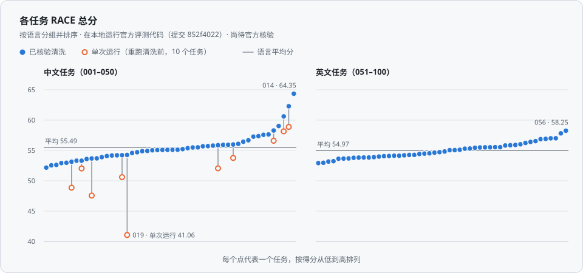

<!-- 由 data/deep-cove-research.jsonl、results/race_scores.json 和 results/cleaning_evidence.json 生成；请勿手动编辑。 -->

<p align="center">
  
</p>

<h1 align="center">deep-cove-research</h1>

<p align="center">
  专有深度研究系统。<br>
  本仓库发布其在 DeepResearch Bench 上的全部 100 篇报告（由 GPT-5.6 Luna 以最高推理设置撰写）及 RACE 评测结果。
</p>

<p align="center">
  <a href="https://github.com/Ayanami0730/deep_research_bench"></a>
  <a href="reports/README.md"></a>
  <a href="#results"></a>
  <a href="https://huggingface.co/spaces/muset-ai/DeepResearch-Bench-Leaderboard"></a>
  <a href="LICENSE"></a>
</p>

<p align="center">
  <a href="#results">评测结果</a> · <a href="#reports">报告</a> · <a href="#how-it-works">工作流程</a> · <a href="#data">数据</a> · <a href="#reproducing-the-evaluation">复现评测</a> · <a href="#citation">引用</a>
  &nbsp;|&nbsp; <a href="README.md">English</a> · <b>中文</b>
</p>

> [!NOTE]
> **状态（截至 2026-09-25）：** 本页分数来自在本地运行的 DeepResearch Bench 官方 RACE 评测代码（提交 `852f4022`，默认评测设置）。尚待官方核验；经官方核验的结果见[官方排行榜](https://huggingface.co/spaces/muset-ai/DeepResearch-Bench-Leaderboard)。本仓库发布 100 篇报告及其评测结果，不公开系统源代码。

## <a name="results"></a>评测结果

DeepResearch Bench 共有 100 个研究任务，其中中文 50 个、英文 50 个。其 RACE 指标以基准的参考报告为对照，从全面性、洞察力、指令遵循和可读性四个维度为每篇报告打分，评分标准与权重按任务分别设定。分数采用排行榜的 0–100 分制。

| 评测方式 | 总分 | 全面性 | 洞察力 | 指令遵循 | 可读性 |
|:--|--:|--:|--:|--:|--:|
| 已核验清洗 ¹ | **55.23** | 55.80 | 55.92 | 55.23 | 52.26 |
| 单次运行 ² | 54.81 | 55.25 | 55.48 | 54.85 | 52.10 |

1. **已核验清洗：** 官方流程；对单次运行中清洗输出被截断的 10 篇报告再运行一次清洗步骤，并按返回的结果评分（见[清洗步骤说明](#cleaning-step)）；其余 90 篇报告在两行中的得分相同。“已核验”指我们对清洗步骤的复查（即 [`results/race_scores.json`](results/race_scores.json) 中的 `verified_cleaning`），不是官方核验；官方核验尚待完成。
2. **单次运行：** 官方流程完整运行一次，接受全部清洗输出。

两行均已对全部 100 个任务评分；在本地运行官方评测代码（提交 `852f4022`，默认评测设置；基准的官方 RACE 评测模型为 GPT-5.5）。

### <a name="by-language"></a>按语言

| 任务 | 平均分（已核验清洗） | 平均分（单次运行） | 最低 – 最高（已核验清洗） |
|:--|--:|--:|--:|
| 中文（001–050） | 55.49 | 54.65 | 52.17 – 64.35 |
| 英文（051–100） | 54.97 | 54.97 | 52.92 – 58.25 |
| 全部 100 个 | **55.23** | 54.81 | 52.17 – 64.35 |

以上为 [`results/race_scores.json`](results/race_scores.json) 中各任务总分的平均值；全部 100 个任务的平均值即上表总分。该文件的逐任务数据只有总分，因此四个维度无法按语言拆分。

<p align="center">
  <picture>
    <source media="(prefers-color-scheme: dark)" srcset="assets/scores-zh-dark.svg">
    
  </picture>
</p>

<sub>**图 1.** 各任务 RACE 总分，按语言分组并排序。实心点：已核验清洗；空心点：重新运行清洗步骤的 10 个中文任务的单次运行得分；横线：各语言平均分。全部数值见[报告索引](reports/README.md)。</sub>

## <a name="reports"></a>报告

每篇报告都有独立页面：报告得分、基准题目，以及与提交内容完全一致的报告原文。

**[浏览全部 100 篇报告 →](reports/README.md)**

<details>
<summary>按任务编号跳转到报告</summary>

<table>
  <tr><th rowspan="5">中文</th><td align="center"><a href="reports/zh/001.md">001</a></td><td align="center"><a href="reports/zh/002.md">002</a></td><td align="center"><a href="reports/zh/003.md">003</a></td><td align="center"><a href="reports/zh/004.md">004</a></td><td align="center"><a href="reports/zh/005.md">005</a></td><td align="center"><a href="reports/zh/006.md">006</a></td><td align="center"><a href="reports/zh/007.md">007</a></td><td align="center"><a href="reports/zh/008.md">008</a></td><td align="center"><a href="reports/zh/009.md">009</a></td><td align="center"><a href="reports/zh/010.md">010</a></td></tr>
  <tr><td align="center"><a href="reports/zh/011.md">011</a></td><td align="center"><a href="reports/zh/012.md">012</a></td><td align="center"><a href="reports/zh/013.md">013</a></td><td align="center"><a href="reports/zh/014.md">014</a></td><td align="center"><a href="reports/zh/015.md">015</a></td><td align="center"><a href="reports/zh/016.md">016</a></td><td align="center"><a href="reports/zh/017.md">017</a></td><td align="center"><a href="reports/zh/018.md">018</a></td><td align="center"><a href="reports/zh/019.md">019</a></td><td align="center"><a href="reports/zh/020.md">020</a></td></tr>
  <tr><td align="center"><a href="reports/zh/021.md">021</a></td><td align="center"><a href="reports/zh/022.md">022</a></td><td align="center"><a href="reports/zh/023.md">023</a></td><td align="center"><a href="reports/zh/024.md">024</a></td><td align="center"><a href="reports/zh/025.md">025</a></td><td align="center"><a href="reports/zh/026.md">026</a></td><td align="center"><a href="reports/zh/027.md">027</a></td><td align="center"><a href="reports/zh/028.md">028</a></td><td align="center"><a href="reports/zh/029.md">029</a></td><td align="center"><a href="reports/zh/030.md">030</a></td></tr>
  <tr><td align="center"><a href="reports/zh/031.md">031</a></td><td align="center"><a href="reports/zh/032.md">032</a></td><td align="center"><a href="reports/zh/033.md">033</a></td><td align="center"><a href="reports/zh/034.md">034</a></td><td align="center"><a href="reports/zh/035.md">035</a></td><td align="center"><a href="reports/zh/036.md">036</a></td><td align="center"><a href="reports/zh/037.md">037</a></td><td align="center"><a href="reports/zh/038.md">038</a></td><td align="center"><a href="reports/zh/039.md">039</a></td><td align="center"><a href="reports/zh/040.md">040</a></td></tr>
  <tr><td align="center"><a href="reports/zh/041.md">041</a></td><td align="center"><a href="reports/zh/042.md">042</a></td><td align="center"><a href="reports/zh/043.md">043</a></td><td align="center"><a href="reports/zh/044.md">044</a></td><td align="center"><a href="reports/zh/045.md">045</a></td><td align="center"><a href="reports/zh/046.md">046</a></td><td align="center"><a href="reports/zh/047.md">047</a></td><td align="center"><a href="reports/zh/048.md">048</a></td><td align="center"><a href="reports/zh/049.md">049</a></td><td align="center"><a href="reports/zh/050.md">050</a></td></tr>
  <tr><th rowspan="5">英文</th><td align="center"><a href="reports/en/051.md">051</a></td><td align="center"><a href="reports/en/052.md">052</a></td><td align="center"><a href="reports/en/053.md">053</a></td><td align="center"><a href="reports/en/054.md">054</a></td><td align="center"><a href="reports/en/055.md">055</a></td><td align="center"><a href="reports/en/056.md">056</a></td><td align="center"><a href="reports/en/057.md">057</a></td><td align="center"><a href="reports/en/058.md">058</a></td><td align="center"><a href="reports/en/059.md">059</a></td><td align="center"><a href="reports/en/060.md">060</a></td></tr>
  <tr><td align="center"><a href="reports/en/061.md">061</a></td><td align="center"><a href="reports/en/062.md">062</a></td><td align="center"><a href="reports/en/063.md">063</a></td><td align="center"><a href="reports/en/064.md">064</a></td><td align="center"><a href="reports/en/065.md">065</a></td><td align="center"><a href="reports/en/066.md">066</a></td><td align="center"><a href="reports/en/067.md">067</a></td><td align="center"><a href="reports/en/068.md">068</a></td><td align="center"><a href="reports/en/069.md">069</a></td><td align="center"><a href="reports/en/070.md">070</a></td></tr>
  <tr><td align="center"><a href="reports/en/071.md">071</a></td><td align="center"><a href="reports/en/072.md">072</a></td><td align="center"><a href="reports/en/073.md">073</a></td><td align="center"><a href="reports/en/074.md">074</a></td><td align="center"><a href="reports/en/075.md">075</a></td><td align="center"><a href="reports/en/076.md">076</a></td><td align="center"><a href="reports/en/077.md">077</a></td><td align="center"><a href="reports/en/078.md">078</a></td><td align="center"><a href="reports/en/079.md">079</a></td><td align="center"><a href="reports/en/080.md">080</a></td></tr>
  <tr><td align="center"><a href="reports/en/081.md">081</a></td><td align="center"><a href="reports/en/082.md">082</a></td><td align="center"><a href="reports/en/083.md">083</a></td><td align="center"><a href="reports/en/084.md">084</a></td><td align="center"><a href="reports/en/085.md">085</a></td><td align="center"><a href="reports/en/086.md">086</a></td><td align="center"><a href="reports/en/087.md">087</a></td><td align="center"><a href="reports/en/088.md">088</a></td><td align="center"><a href="reports/en/089.md">089</a></td><td align="center"><a href="reports/en/090.md">090</a></td></tr>
  <tr><td align="center"><a href="reports/en/091.md">091</a></td><td align="center"><a href="reports/en/092.md">092</a></td><td align="center"><a href="reports/en/093.md">093</a></td><td align="center"><a href="reports/en/094.md">094</a></td><td align="center"><a href="reports/en/095.md">095</a></td><td align="center"><a href="reports/en/096.md">096</a></td><td align="center"><a href="reports/en/097.md">097</a></td><td align="center"><a href="reports/en/098.md">098</a></td><td align="center"><a href="reports/en/099.md">099</a></td><td align="center"><a href="reports/en/100.md">100</a></td></tr>
</table>

</details>

**节选**：第一个中文任务 [001](reports/zh/001.md) 的报告

> 截至2026年9月13日，能够由公开证据支持的结论是：**中国不存在一套由国家统计局或同行评审研究统一确认、同时给出九个阶层收入、财富、负债和人口占比的现行官方模型**。目前能直接找到的“九阶层”是2014年网络传播的社会位置模型，它按政治影响力、职业、城市生存能力等定性区分，并不是收入或财富统计表。

## <a name="how-it-works"></a>工作流程

<p align="center">
  <picture>
    <source media="(prefers-color-scheme: dark)" srcset="assets/pipeline-zh-dark.svg">
    
  </picture>
</p>

<sub>**图 2.** deep-cove-research 处理每个问题的六个阶段。</sub>

对于每个问题，deep-cove-research 会：

1. 规划研究：明确需要回答什么，以及报告应如何组织；
2. 检索开放网络与学术文献；
3. 阅读所选来源的全文；
4. 从中提取带引用的发现；
5. 对照问题的要求检查覆盖情况；
6. 撰写长篇报告。

报告由 **GPT-5.6 Luna** 以最高推理设置撰写。

## <a name="report-statistics"></a>报告统计

| | 中文（001–050） | 英文（051–100） | 全部 100 篇 |
|:--|--:|--:|--:|
| 长度中位数（字符） | 29,832.5 | 91,564 | 50,479 |
| 最短 – 最长（字符） | 12,558 – 48,775 | 52,183 – 124,994 | 12,558 – 124,994 |
| 长度中位数（英文词数） | – | 12,238 | – |
| 每篇来源链接数中位数 | 58 | 61 | 58.5 |
| 每篇不同来源数中位数 | 38.5 | 43 | 41 |
| 全部报告的不同来源网址 | 1,935 | 2,078 | 4,007 |
| 章节数中位数（二级标题） | 8 | 9 | 8.5 |
| 含表格的报告 | 50 / 50 | 50 / 50 | 100 / 100 |

字符数为 Unicode 字符数（即 `results/cleaning_evidence.json` 中的 `raw_chars` 字段）；词数按空白分隔计数，仅统计英文报告。来源链接为报告正文中链接或嵌入的网址，按出现次数计；不同来源数为单篇报告中不重复网址的数量。“全部报告的不同来源网址”按列去重；有 6 个网址同时出现在中文与英文报告中，因此“全部”一列小于两种语言之和。

## <a name="cleaning-step"></a>清洗步骤说明

评分前，官方流程会先让模型删除每篇报告中的引用，评测模型随后对清洗后的文本打分。[`results/cleaning_evidence.json`](results/cleaning_evidence.json) 记录了每篇报告在该步骤前后的长度。

在单次运行中，50 篇中文报告里有 10 篇的清洗输出被截断，只保留了原报告 11.3%–66.4% 的字符，而流程接受了这些输出。其余 90 篇报告在该步骤中保留了 70.2%–97.9% 的字符（中位数 89.1%）。我们对这 10 篇报告重新运行了清洗步骤；“已核验清洗”一行采用重新运行的结果，其余 90 篇的得分不变。

| 任务 | 报告长度（字符） | 保留比例（单次运行） | 保留比例（重新运行） | 得分（单次运行） | 得分（已核验清洗） |
|--:|--:|--:|--:|--:|--:|
| [005](reports/zh/005.md) | 30,150 | 33.1% | 84.0% | 52.05 | 55.87 |
| [008](reports/zh/008.md) | 32,298 | 18.9% | 33.5% | 48.86 | 53.14 |
| [011](reports/zh/011.md) | 30,518 | 66.4% | 85.0% | 56.60 | 58.29 |
| [016](reports/zh/016.md) | 35,078 | 18.7% | 89.1% | 58.88 | 62.29 |
| [017](reports/zh/017.md) | 28,195 | 12.4% | 82.2% | 47.56 | 53.68 |
| [019](reports/zh/019.md) | 46,765 | 11.3% | 82.4% | 41.06 | 54.26 |
| [020](reports/zh/020.md) | 48,775 | 60.8% | 89.8% | 58.15 | 60.61 |
| [035](reports/zh/035.md) | 31,670 | 32.8% | 84.9% | 53.77 | 55.98 |
| [047](reports/zh/047.md) | 31,869 | 29.4% | 62.8% | 50.60 | 54.22 |
| [050](reports/zh/050.md) | 26,406 | 54.9% | 72.3% | 52.03 | 53.31 |

其中任务 008（33.5%）和 047（62.8%）重新运行后的保留比例仍低于其余 90 篇报告；“已核验清洗”一行直接采用重新运行的结果。就全部 100 个任务而言，总分由 54.81（单次运行）变为 55.23（已核验清洗）。

## <a name="data"></a>数据

```text
deep-cove-research/
├── README.md                      概览（英文）
├── README_zh.md                   概览（中文）
├── data/
│   ├── README.md                  字段说明
│   └── deep-cove-research.jsonl   提交的 100 篇报告，官方格式
├── results/
│   ├── README.md                  字段说明
│   ├── race_scores.json           两种评测方式的总体与各任务 RACE 分数
│   └── cleaning_evidence.json     各任务清洗步骤前后的长度
├── reports/
│   ├── README.md                  全部 100 篇报告的索引
│   ├── zh/001.md … 050.md         中文报告，每篇一页
│   └── en/051.md … 100.md         英文报告，每篇一页
├── assets/                        标志、徽章与图（SVG）
├── CITATION.cff                   引用信息
└── LICENSE                        条款（专有）
```

- [`data/deep-cove-research.jsonl`](data/deep-cove-research.jsonl)：共 100 行，每行一个 JSON 对象（UTF-8），采用 DeepResearch Bench 官方格式，字段为 `id`、`prompt` 和 `article`。任务 1–50 为中文，51–100 为英文。文件大小 8,010,129 字节；SHA-256 `2578948bbb4555c30c3dc9c1bc245a59e2c1575f0c2a8fd5c3f7c3ccad3c12e3`。字段说明见 [data/README.md](data/README.md)。
- [`reports/`](reports/README.md) 中的每个页面都逐字节包含对应报告的 `article` 文本，并注明该文本的 SHA-256。
- [`results/`](results/README.md)：RACE 分数与清洗证据；字段说明见 [results/README.md](results/README.md)。
- 未包含：系统源代码、系统内部提示词及中间数据。本仓库只报告 RACE；未包含基准的 FACT 引用指标。

## <a name="reproducing-the-evaluation"></a>复现评测

1. 从 [DeepResearch Bench 仓库](https://github.com/Ayanami0730/deep_research_bench) 获取官方评测代码，并切换到提交 `852f4022`。
2. 将本仓库的 `data/deep-cove-research.jsonl` 复制到该代码目录下，路径为 `data/test_data/raw_data/deep-cove-research.jsonl`。
3. 在 `run_benchmark.sh` 的 `TARGET_MODELS` 中加入 `deep-cove-research`。
4. 按基准 README 的说明配置评测模型的访问，并保持默认评测设置。
5. 运行 `run_benchmark.sh`，本页只报告其 RACE 阶段。RACE 汇总结果写入 `results/race/deep-cove-research/race_result.txt`（0–1 分制，本页乘以 100 显示）；清洗后的报告写入 `data/test_data/cleaned_data/deep-cove-research.jsonl`，可与 `results/cleaning_evidence.json` 对照。

清洗步骤与评测模型都是语言模型，因此重新运行可能得到不同的分数。上文的清洗重跑即是一例：任务 019 的得分由 41.06 变为 54.26，总分由 54.81 变为 55.23。

## <a name="citation"></a>引用

如引用这些报告或结果，请同时引用本仓库与 DeepResearch Bench 论文。

**本仓库**

```bibtex
@misc{deepcoveresearch2026,
  title = {deep-cove-research: DeepResearch Bench Reports and Evaluation Results},
  author = {{deep-cove-research}},
  year = {2026},
  howpublished = {\url{https://github.com/aldrinor/deep-cove-research}},
  note = {100 reports (50 Chinese, 50 English); RACE scores from a local run
          of the official evaluation code, commit 852f4022; official verification pending},
}
```

**DeepResearch Bench**

```bibtex
@inproceedings{ICLR2026_465f22be,
  author = {Du, Mingxuan and Xu, Benfeng and Zhu, Chiwei and Zhang, Licheng and Wang, Xiaorui and Mao, Zhendong},
  booktitle = {International Conference on Learning Representations},
  editor = {C. Vondrick and B. Hariharan and C. Raffel and L. Pinto and D. Yang and A. Faust},
  pages = {42414--42448},
  title = {DeepResearch Bench: A Comprehensive Benchmark for Deep Research Agents},
  url = {https://proceedings.iclr.cc/paper_files/paper/2026/file/465f22be10e07b301c6ed58f0472f704-Paper-Conference.pdf},
  volume = {2026},
  year = {2026},
}
```

## <a name="license"></a>许可

专有。本仓库中的报告与评测结果 © 2026 deep-cove-research，保留所有权利；详见 [LICENSE](LICENSE)。报告页面与 `prompt` 字段中的基准题目属于 DeepResearch Bench，归其作者所有。系统源代码不公开。

## <a name="contact"></a>联系方式

aor@cpolartechnologies.com

## <a name="acknowledgements"></a>致谢

感谢 DeepResearch Bench 团队（Mingxuan Du、Benfeng Xu、Chiwei Zhu、Licheng Zhang、Xiaorui Wang、Zhendong Mao）提供基准、官方评测代码与排行榜。
